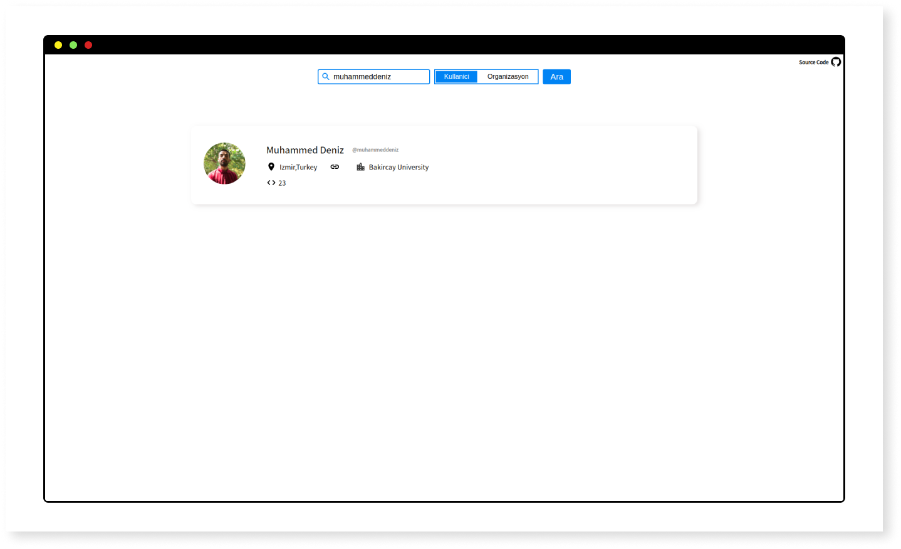
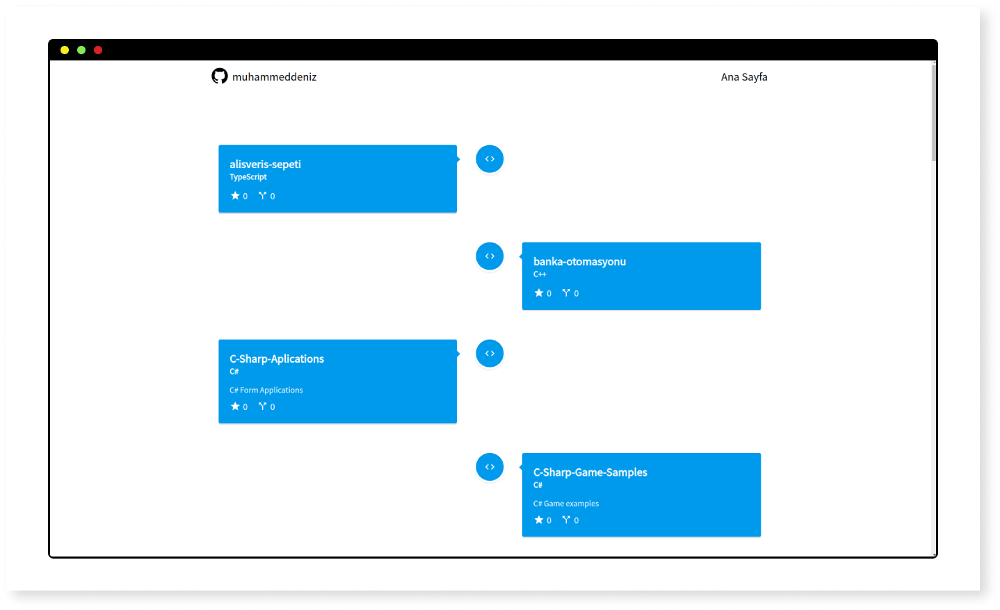

# Github Api Repos

You can search github repos with this project.

</br>
</br>

## Stack

- Create React App
- React Router Redux
- axios
- react-vertical-timeline-component

</br>
</br>

## Quick Start

```sh
git clone https://github.com/muhammeddeniz/github-api-repos.git
cd github-api-repos
yarn install
yarn start
```

</br>
</br>

## Screens



